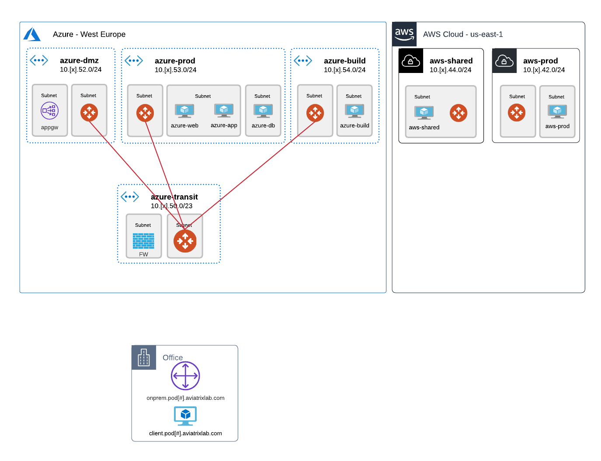
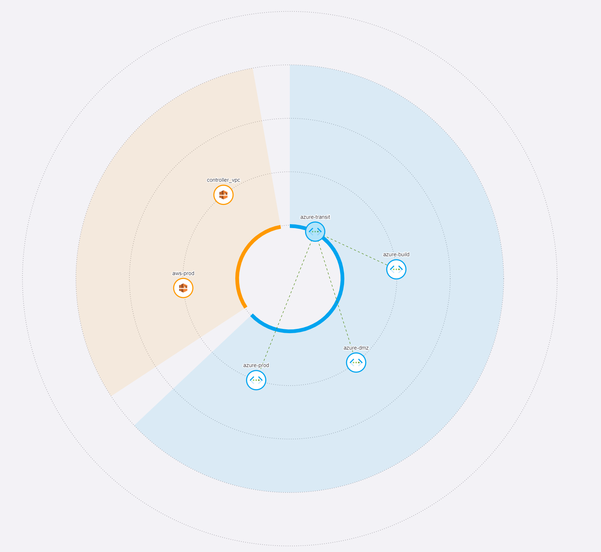
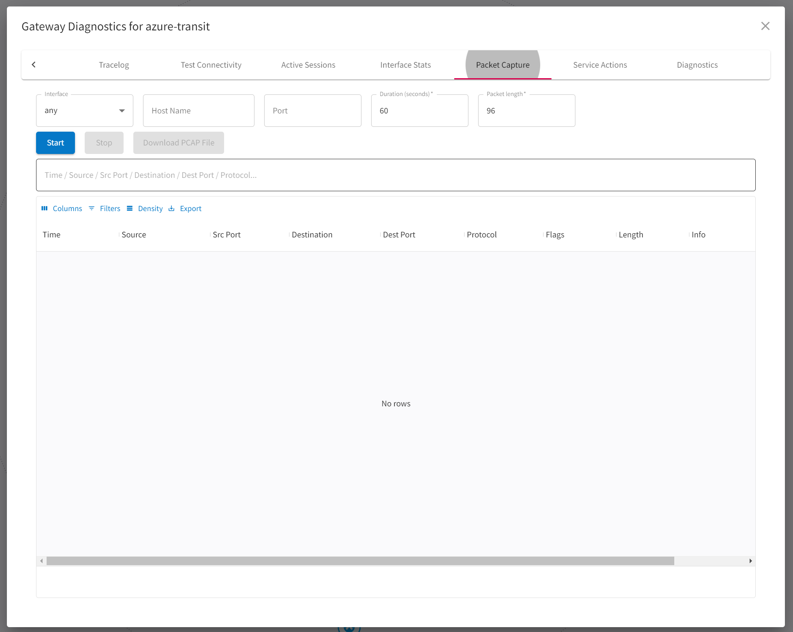
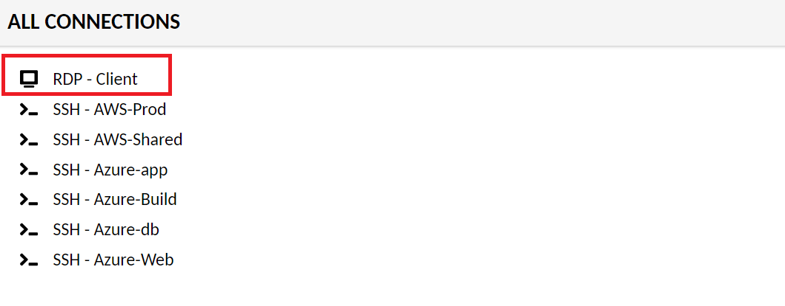
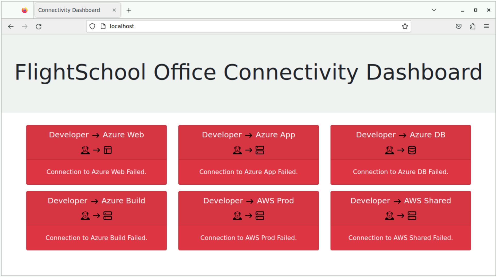
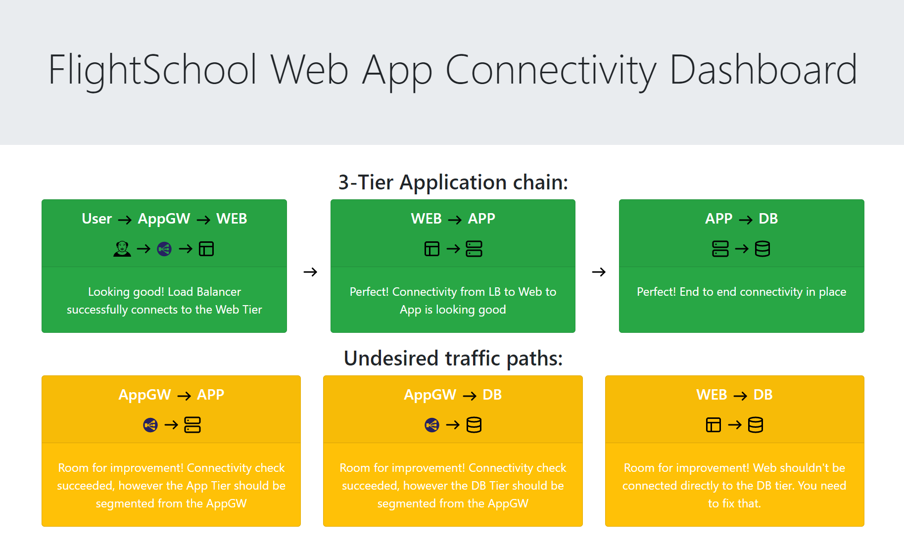

# Lab 1

## Lab Overview - What's in the lab?

Lab time: ~15 minutes

In this lab, we are going to explore our lab environment. The diagram below shows the current state of the lab environment. You will extend this environment during the exercises. The instructor will briefly explain the lab setup in the diagram. You can find a more complete and detailed diagram here.


_Fig. Lab Overview_

## Lab 1.1 - CoPilot

### Description

Along with the Aviatrix Controller, CoPilot is also deployed. CoPilot will be your best buddy for configuring, visualizing and operating the Multicloud environment.

### Validate

Log in to CoPilot using the following details:

**URL:**  ```https://cplt.pod[#].aviatrixlab.com```  
**Username:**  ```student```  
**Password:** <span style="color:orange">***Please refer to your portal registration page for the password.***</span>  

* _Remember to replace <span style="color:orange">**[#]**</span> with your pod ID_

You can familiarize yourself with the different functions in CoPilot and after each lab, we will verify the results in CoPilot.
**Please note that it can take a minute for CoPilot to reflect changes on the network.**

The `Dashboard` tab provides a global overview of your Multicloud network, the status, how much traffic is flowing, locations deployed, etc.  

Take a look into `Cloud Fabric-->Topology` which visualizes the connectivity of the Multicloud environment. Make sure you have `New topology experience` enabled. Topology will show you latency between links when you enable it on the top right hand corner in the latency pane. The topology view also allows you to initiate some troubleshooting commands directly from the map. Expand `azure-transit` in the middle of the screen, by clicking on it. Now you should see and be able to select the `azure-transit` gateway on the outside edge of the diagram. On the bottom right, you should see a diagnostics button. Click that and explore the diagnostics capabilities.

### Expected Results

You should be able to log in to CoPilot. You should be able to view Topology by clicking `Cloud Fabric` -> `Topology` and see the current Multicloud Network topology. Topology should look similar to this:  

  
_Fig. Initial Topology_  

As you can see, we have the azure-transit gateway in the middle, with azure-build, azure-dmz and azure-prod spokes connected to it. The AWS VPC's are not yet connected to any transit.

After selecting the transit gateway and clicking the diagnostics tools button, you should see the diagnostics pane. Have a look around at the troubleshooting tools here.

  
_Fig. CoPilot Diagnostics_  

  
_Fig. CoPilot Diagnostics Pane_  

Close the diagnostics pane again.

## Lab 1.2 - Access Accounts

### Description

In order for the controller to be able to access the different CSP environments, we need to provide it with accounts with the correct privileges.

### Validate

Take a look at the access accounts already set up. You can see them in Copilot under **_Cloud Resources -> Cloud Account_**.

### Expected Results

Accounts in AWS and Azure have already been onboarded and you should see the these accounts in the list. The accounts should also have an audit status **_pass_**, meaning the permissions in the accounts are correctly configured.

## Lab 1.3 - Connectivity Check

### Description

Each Spoke VPC / VNet contains one or multiple Linux VM's to test connectivity. There is a web server running on each of the instances which you can use to test the connectivity. The purpose of this exercise is to verify the connectivity between Linux VMs in the Spoke VPCs / VNets in the different clouds as well as the Office network. To make life a little easier, we have created 2 dashboards to show the status of all connectivity.

### Validate

In order to view the connectivity dashboards, a Remote Access Server is placed in the office.  We need to log on to the Remote Access Server we have deployed throughout the lab which can be accessed here:

**URL:** ```https://client.pod[#].aviatrixlab.com```  
**User:** ```student```  
**Password:** <span style="color:orange">***Please refer to your portal registration page for the password.***</span>  

* _Remember to replace <span style="color:orange">**[#]**</span> with your pod ID_
* _If you want to use copy/paste in this Guacamole web console, use CTRL+ALT+SHIFT on a Windows device or CTRL+CMD+SHIFT on a MacOS device._

* Connect into **RDP - Client** from the *ALL CONNECTIONS* pane.  

  
_Fig. Remote Access Server_  

* Open the web browser and browse to the office connectivity dashboard ```http://localhost```

Now that we have validated the office connectivity, lets check the public web application that is already deployed in Azure.

* Open the web browser and browse to the Web App connectivity dashboard ```http://azure-lb.pod[#].aviatrixlab.com/test```
* _Remember to replace <span style="color:orange">**[#]**</span> with your pod ID_

### Expected Results

* None of the connections from the office will be successful. Look at the Diagram in the Lab 1 Overview and you will see that the office is not connected yet.

  
_Fig. Office connectivity_  

* Connectivity to the appgw, web, app and db servers should be working, proving that the already deployed application in Azure is up.

  
_Fig. Web app connectivity_  

## End of lab 1

Ok, that's the end of Lab 1. Great job!
