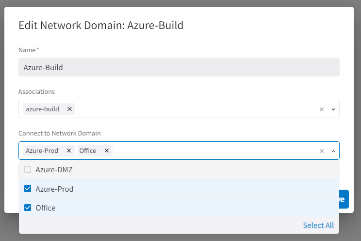

# Lab 2 - Office Connectivity

Lab time: ~45 minutes  

**_Scenario_**:  Your development team needs direct access to the azure-build server in Azure. This requires a VPN connection from the office, into the cloud infrastructure.

During this lab we will build and verify the connectivity to your office.

  
_Fig. Azure Deployment_

## Lab 2.1 - Connection to the Office

### Description

Your on-prem Network team has already configured an IPSec tunnel on the office router, pointing to your Aviatrix Transit Gateway deployed in the Azure Transit VNET. In this lab you will need to configure the tunnel in the Aviatrix Transit Gateway for the tunnel to establish connectivity.

### Validate

In order to connect your Multicloud environment to the office, we will create an **_External Connection_**. This allows you to create a secure connectivity between the Cloud and the office with dynamic routing (BGP).

Now let’s add the office connection. In Copilot, navigate to **_Networking --> Connectivity --> External Connections (S2C)_**. Click the **_+ External Connection_** button to add a new connection.

|                             |                                                                                                                                                                                                                       |
| --------------------------- | --------------------------------------------------------------------------------------------------------------------------------------------------------------------------------------------------------------------- |
| **Connection Name**         | azure-to-office                                                                                                                                                                                                       |
| **Connect public cloud to** | External Device, BGP over IPsec                                                                                                                                                                                       |
| **Local Gateway**           | azure-transit                                                                                                                                                                                                         |
| **Local ASN**               | 65pod[#] _For Pods 1-9, double pad the pod# with an additional 0 (ie. 65004). For Pods 10-99 single pad (ie. 65010). For Pods > 100, no padding is needed (ie. 65100)_                                                |
| **Remote ASN**              | 65000                                                                                                                                                                                                                 |
| **Remote Gateway IP**       | <ip-address> _Please open a terminal session in your workstation and resolve the following FQDN to its IP address `onprem.pod[#].aviatrixlab.com`. Do NOT enter the FQDN on this field. Instead enter the IP address_ |
| **Pre-shared Key**          | mapleleafs                                                                                                                                                                                                            |
| **Local Tunnel IP**         | 169.254.100.2/30                                                                                                                                                                                                      |
| **Remote Tunnel IP**        | 169.254.100.1/30                                                                                                                                                                                                      |

It should look something like the example below. Make sure to put in your own remote gateway IP and AS number though.

  
_Fig. Configure IPsec_

* Hit **_save_** to execute the changes.

After 1-2 minutes, you should see that the connection to the office is configured and up (green).

  
_Fig. Tunnel up_

In order to test connectivity between cloud and the office, a test VM is available in the office with the FQDN `client-int.pod[#].aviatrixlab.com`. The IPSec tunnel is up, but maybe there is another blocker that prevents connectivity. Try the following test:

* From CoPilot, navigate to **_Cloud Fabric-->Topology_**
* Click on the **_azure-transit_** node. You should now see the connection to the office.
* Click on the **Aviatrix Gateway icon (_azure-transit_)** and then click the Diagnostic Tools button on the right bottom of the screen (see lab 1.5 if you are unable to locate it).
* Under the ping tab, enter the hostname `client-int.pod[#].aviatrixlab.com` and click PING

  
_Fig. CoPilot Diag_  

> Was the ping successful?

### Expected Results

The Site2Cloud connection should be green and the BGP session should be established.  Still, connectivity tests should fail due to the route filtering on the transit which we will fix in the next step.

Our lab environment now looks like this:  

  
_Fig. Topology with On-Prem Connectivity_  

## Lab 2.2 - Approve the Learned Routes

### Description

Aviatrix allows you to filter dynamically learned routes from external sites, and the azure-transit Gateway deployed in this lab has Route Approval enabled.  We want to approve the summarized route learned from on-prem.

### Validate

* Browse to the transit gateway settings in Copilot, under **_Cloud Fabric -> Gateways -> Transit Gateways_** and click on **_azure-transit_**.
* Navigate to the Approval pane and approve the pending CIDR.

If no CIDR's are showing up here, validate that the BGP peering has established under **_Troubleshoot -> Cloud Routes -> BGP Info_**. If the peering is down, you likely made a configuration error.

  
_Fig. Approve route_  

* From CoPilot Topology, run **Diag** from the azure-transit gateway once again
* Under the **Ping** tab, enter the hostname `client-int.pod[#].aviatrixlab.com` and click PING

> Was the ping successful this time?

### Expected Results

After adding the connection to on-prem and approving the learned routes, the connectivity tests should be successful. The process of route approvals allows you to be in charge of the learned routes!

## Lab 2.3 - Office Connectivity Tests

### Description

At this point, the office is connected to the Aviatrix Transit Gateway in Azure. This should provide the developers with connectivity to the azure-build server.

### Validate

* Open the Remote Access Server and open the **RDP - Client** (or navigate to `https://client.pod[#].aviatrixlab.com`). This is the on-prem Host.
* Open up the Firefox browser on the RDP desktop
* Navigate to `http://azure-build.pod[#].aviatrixlab.com` or just `http://azure-build`

### Expected Results

* You should see something similar to the following screenshot. Note you're connecting across the site2cloud connection to the dmz spoke via the transit gateway.
* Remember the **source port** for the next exercise

  
_Fig. Connectivity Test_  

## Lab 2.4 - Verify the Flow Logs

### Description

CoPilot provides very rich visibility into all traffic going across the Aviatrix overlay network.  Once you generate some traffic, this should be visible in CoPilot.

### Validate

* Open **CoPilot** -> **Monitor** -> **FlowIQ** and click **Last 60 Minutes** to update the Date Range Filters
* Using the source port from the previous lab, let's create the following filter:
  * Click in the **Filters** box. Under **Matches all conditions (AND)**, select the metric **Source Port**
  * Select **equals**
  * Then, enter the source port from the website of the previous exercise and hit **_Apply_**. The Overview immediately filters to your criteria.

> New flow records might appear 1-2 minutes after they occurred, so just click on **Refresh Data** a few times to refresh the time period

  
_Fig. FlowIQ Filter_  

### Expected Results

* By filtering on the source port, you should be able to see all of the details behind the traffic generated from on-prem

  
_Fig. FlowIQ Overview_  

* By clicking on the **Records** tab, you will see the raw flow records
* The most relevant fields are shown by default, but you can create custom views and show additional metadata relating to the traffic flows

  
_Fig. FlowIQ Records_  

> **Note** - Gateway and Interface Names show up after a specific polling interval.  If the Gateway or Spoke Attachment is newly created, the fields will be displayed after the configured CoPilot polling interval (default is one hour)

* By looking at the flow records, you can trace the path that a flow took and also see over which gateways the flow crossed

## Lab 2.5 - Check office connectivity

### Description

While we have achieved our objective of providing the development team with access to the azure-build server, perhaps we have given them more access than desirable. Let's verify this.

### Validate

* Open the Remote Access Server and open the **RDP - Client** (or navigate to `https://client.pod[#].aviatrixlab.com`). This is the on-prem Host.
* Open up the Firefox browser on the RDP desktop
* Navigate to `http://localhost`

> Do we have access to more destinations than expected?

### Expected Results

* As you can see, you now have access to all servers in Azure.

  
_Fig. Full Access_

## Lab 2.6 - Enable network segmentation

### Description

Now that we have established, that too much network access to the Azure environment has been granted to the development team, let's limit the exposure and reduce the security risks.

### Validate

* In the Copilot, go to **_Networking -> Network Segmentation -> Network Domains_**. and click the Transit gateways button.
* In the transit gateway pane, enable segmentation for azure-transit.

  
_Fig. Transit Segmentation_

  
_Fig. Enable Segmentation_

### Expected Results

Now that segmentation is enabled on azure-transit, we can continue and build out Network Domains.

## Lab 2.7 - Create Network Domains

### Description

Let's create some network domains, which can be used for segmentation.

### Validate

In CoPilot, go to **_Networking -> Network Segmentation -> Network Domains_**. As you can see, we don't have any network domains set up currently. Use the **_+ Network Domains_** button to add the following domains and associations:

| Domain      | Association     |
| :---------- | :-------------- |
| Office      | azure-to-office |
| Azure-Build | azure-build     |
| Azure-Prod  | azure-prod      |
| Azure-DMZ   | azure-dmz       |

  
_Fig. Add network domains_

### Expected Results

After adding the network domains and associations, you should see the following in Copilot:

  
_Fig. Network domains result_

## Lab 2.8 - Check office connectivity

### Description

Now that we have implemented network segmentation, let's verify that we have limited the connectivity for developers in the office.

### Validate

* Go back to the Office connectivity dashboard and check the connectivity status.

> Were these connections successful?

### Expected Results

* None of the connections should succeed. We have successfully limited developer access to Azure, but now we have lost access to the build server as well!

  
_Fig. Office connectivity_  

## Lab 2.9 - Create a connection policy

### Description

In order for our developers to be able to access the build server again, we need to create a connection policy, that allows traffic between the Office network domain and the Azure-Build network domain. In addition, the build server needs access to the azure-web and azure-app server. So we're going to need a connection policy for that as well!

### Validate

* Edit the **_Azure-Build_** network domain under **_Networking -> Network Segmentation -> Network Domains_** in Copilot.

  
_Fig. Edit network domain_

* Now add the **_Office_** and **_Azure-Prod_** domain as a connected domain.

  
_Fig. Add network domain connection_

### Expected Results

* The network domains should now be connected to each other, as shown on the screenshot below.
* Another great place to visualize the connectivity between network domains is **_Networking -> Network Segmentation-> Overview_**.

  
_Fig. Add network domain connection_

  
_Fig. Network domain overview_

## Lab 2.10 - Check office connectivity

### Description

Now that we have implemented the connectivity policies, let's verify that we have limited the connectivity for developers in the office.

### Validate

* Go back to the Office connectivity dashboard and check the connectivity status.

> Were these connections successful?

### Expected Results

* The developers in the office now should only have access to the build server!

  
_Fig. Office connectivity_  

## Lab 2.11 - Fix Azure application

### Description

Now that we have enabled segmentation, we have not only limited connectivity from the office to Azure, but also between the network domains inside Azure. Since the application in Azure is dependent on connectivity between the DMZ and Prod VNET's, we need to fix this.

### Validate

First check that the connectivity is indeed broken.

* From your own pc connect to:
  * `http://azure-lb.pod[#].aviatrixlab.com/test`

As you can see, the Web web application is now broken:

  
_Fig. Office connectivity_  

* Check the connection policies on the **_Networking -> Network Segmentation-> Overview_** page. Do you see a line connecting Azure-DMZ and Azure-Prod?
* Create a connection policy between Azure-DMZ and Azure-Prod, similar to what you did in lab 2.9.

  
_Fig. Add connection policy_  

Check that the connectivity is restored.

  
_Fig. Web app connectivity_  

### Expected Results

* After setting up the connectivity policy, you should be able to connect to all tiers of the Azure application again.

## Lab 2 Summary

* Congratulations - you successfully connected your office to Azure
* Not a single route table entry needed to be touched on the cloud provider side
* You have end to end visibility into all network traffic
* You have limited the scope of connectivity from the office, using network segmentation
* You have reestablished connectivity between the Azure-DMZ and Azure-Prod VNET's after implementing network segmentation.
