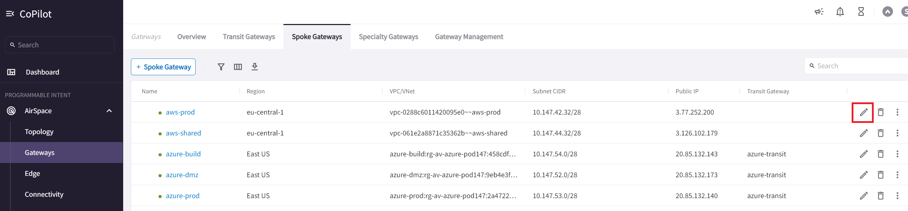

# Lab 3 - Expanding to multi-cloud

Lab time: ~30 minutes

**_Scenario_**:  The business has decided to go multi-cloud! Some apps simply run better in other clouds, and why put all eggs in one basket? During this exercise we will deploy in AWS an Aviatrix Transit VPC, Transit Gateway and attach the existing spoke gateways to the aws transit. We will also peer Azure and AWS and test out the connectivity.

The Spoke VPCs and gateways have already been created to save you time. The process is very similar to deploying the transit gateway though.

  
_Fig. Current Topology_  

## Lab 3.1 - Deploy the AWS transit VPC

### Description

Let's go ahead and create the Transit VPC in AWS using the topology builder in Copilot.

### Validate

* Log in to Aviatrix Copilot
* Scroll down on the left-hand pain to **_Cloud Fabric -> Topology -> Builder_**
* Click **Select Cloud Region** and enter the following fields:

|                    |                          |
| ------------------ | ------------------------ |
| **Cloud Provider** | AWS                      |
| **Account**        | aws-account              |
| **Region**         | eu-central-1 (Frankfurt) |

  
_Fig. Set up the topology builder_  

* Hit save to start the configuration session.
* Click The "+" sign next to transit, to add a new transit.

  
_Fig. Add transit_  

* Enter the following fields:

|                         |                     |
| ----------------------- | ------------------- |
| **Transit Gateway VPC** | Create New VPC/VNet |
| **VPC Name**            | aws-transit         |
| **VPC CIDR**            | 10.pod[#].40.0/23   |

For the VPC CIDR, replace **pod[#]** with your pod number. For example, if your pod number is 150, pod[#] should be replaced with 150, so the complete CIDR will become 10.150.40.0/23. The topology builder will automatically create all the required public and private subnets, IGW, and routing tables.

  
_Fig. Create a VPC_  

Hit save, and the VPC will be created.
  
### Expected Results

You created a VPC with multiple subnets directly in the Aviatrix GUI.

## Lab 3.2 - Deploy the Aviatrix Transit Gateway

### Description

In this exercise we are going to launch the Aviatrix Transit Gateway in the newly created Transit VPC in AWS.

### Validate

* Enter the following fields:

|                          |                                                         |
| ------------------------ | ------------------------------------------------------- |
| **Transit Gateway VPC**  | aws-transit                                             |
| **Gateway Name**         | aws-transit                                             |
| **Gateway Size**         | t3.small                                                |
| **Instance 1 (Primary)** | aws-transit-Public-1-eu-central-1a + Allocate New EIP   |
| **Transit Peers**        | Click edit and add the azure-transit as a peer and save |

  
_Fig. Create Aviatrix Transit Gateway_  

  
_Fig. Configure transit peering_  

* Hit Save to save the transit gateway settings and return to the topology builder overview.
* You now get the option to either generate your changes as Terraform code, or deploy directly from the UI. Choose and click deploy.

  
_Fig. Overview_  

* As you can see, the topology builder will now start to deploy the transit gateway. Wait for this to finish. It will take about 5-10 minutes.

> **Important:** By default, routes are not propagated between spokes attached to the transit gateway. We have to enable a setting on our transit gateway to allow this to happen.  

* Go to **_Cloud Fabric -> Gateways -> Transit Gateways_** and click on **_aws-transit_**.
* Open the settings pane and enable and save **Connected Transit** under the General settings.

  
_Fig. Enable connected transit_  

### Expected Results

Now that we have the aws-transit deployed, peered to azure-transit and have enabled connected transit, we should see these changes reflected in our topology view. (under **_Cloud Fabric -> Topology_**)

  
_Fig. Topology view_  

## Lab 3.3 - Attach Spoke Gateways to Aviatrix Transit Gateway

### Description

Now that we have our aws-transit set up, we need to establish connectivity between the AWS spoke gateways and the aws-transit gateway. The spoke gateways have been pre-deployed to save some time, but the process is much the same as the transit gateway you have just deployed.

### Validate

* Go to **_Cloud Fabric -> Gateways -> Spoke Gateways_**.
* Click the edit button (pencil) behind the **_aws-prod_** gateway. 

  
_Fig. Edit spoke_  

* Change the attachment from empty to **_aws-transit_** and hit save.

  
_Fig. Attach Spoke Gateway to Transit_  

* Repeat the process for the **_aws-shared_** spoke gateway.

### Expected Results
The AWS spoke gateways should now be attached to the aws-transit. Within a few minutes, we should see these changes reflected in our topology view. (under **_Cloud Fabric -> Topology_**)

  
_Fig. CoPilot Topology with Attached Spokes_

* If your topology does not show the connection to the spokes, refresh the page after a minute or so.

## Lab 3.4 - Enable network segmentation on the AWS transit

### Description

Just like we enabled network segmentation on the azure-transit before, we want to extend this segmentation to AWS and enable it on the aws-transit as well.

### Validate

* In the Copilot, go to **_Networking -> Network Segmentation -> Network Domains_**. and click the **_Transit Gateways_** button.
* In the transit gateway pane, enable segmentation for aws-transit.

  
_Fig. Transit Segmentation_

  
_Fig. Enable Segmentation_

### Expected Results

Segmentation is now enabled on both gateways.

## Lab 3.5 - Create Network Domains

### Description

For our AWS spokes, we want to create network domains and associations, just like we did for the Azure spokes before.

### Validate

In CoPilot, go to **_Networking -> Network Segmentation -> Network Domains_**. Use the **_+ Network Domains_** button to add the following domains and associations:

| Domain     | Association |
| :--------- | :---------- |
| AWS-Shared | aws-shared  |
| AWS-Prod   | aws-prod    |

### Expected Results

After adding the network domains and associations, you should see the following in Copilot:

  
_Fig. Add network domains_

## Lab 3.6 - Create a connection policy

### Description

We want the development team in the office, to be able to access AWS-Shared.

### Validate

* Edit the **_Office_** network domain under **_Networking -> Network Segmentation -> Network Domains_** in Copilot.

  
_Fig. Edit network domain_

* Now add the **_AWS-Shared_** domain as a connected domain.

  
_Fig. Add network domain connection_

### Expected Results

* The network domains should now be connected to each other, as shown on the screenshot below.
* Another great place to visualize the connectivity between network domains is **_Networking -> Network Segmentation-> Overview_**.

  
_Fig. Add network domain connection_

  
_Fig. Network domain overview_

## Lab 3.7 - Test Connectivity to AWS Spokes

### Description

The AWS Spokes should be connected to the AWS Transit so now we can check connectivity to the spokes from the office.

### Validate

* Open the Remote Access Server and open the **RDP - Client** (or navigate to `https://client.pod[#].aviatrixlab.com`). This is the on-prem Host.
* Open up the Firefox browser on the RDP desktop
* Navigate to `http://localhost`

> Do we have access to aws-shared and azure-build?

### Expected Results

* As you can see, you now have access to azure-build and aws-shared.

  
_Fig. Office Access_

> Were these connections succesful?

### Expected Results

From the office, you should be able to reach aws-shared, but not aws-prod.

## Lab 3 Summary

* AWS has been onboarded
* You deployed a VPC and an Aviatrix Transit Gateway in AWS
* You connected all of the Spoke VPCs to the Transit
* You created a Multicloud Transit network, connecting AWS and Azure
* You are able to reach the AWS environment from On-Prem, via the Azure Transit
* Again, not a single route table entry needed to be touched on the CSP side
* You have end to end visibility into all network traffic
* All connectivity is private and encrypted across the entirety of the Aviatrix Cloud Fabric - from on-prem and within and between the clouds

  
_Fig. Topology after Lab 3_
