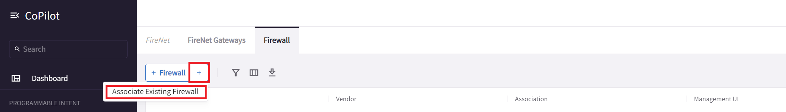

# Lab 4 - Beefing up security

Lab time: ~60 minutes

**_Scenario_**:  FS Corp has just hired a new CISO. They appreciate all the connectivity and guardrails that you have put in place with network segmentation, but their security requirements are more stringent! In this lab, you're going to beef up the security level using Aviatrix' security capabilities.

## Lab 4.1 - Microsegmentation - Inter VNET/VPC

### Description

Because of the connection policy between the DMZ and prod, the Azure AppGW is currently able to reach not just the webserver, but also the app and db servers directly. This is undesirable, so the CISO has demanded you apply microsegmentation policies, to only allow specifically required traffic.

### Validate

We have prepared and installed a microsegmentation policy already. Lets review and modify it.

* Browse to **_Security -> Distributed Firewallling -> Rules_**
* Look at the policy to get an understanding of which rules are set up
* Edit the last policy **_DefaultAllowAll_** and set enforcement to off and hit save

  
_Fig. Disable allow all_  

You should now see that the rule is modified (highlighted in amber).

* Commit the change by clicking the commit button

  
_Fig. Commit changes_  

* Check the connectivity on the web app and Office dashboards

### Expected Results

After enforcing our ruleset as a result of disabling the DefaultAllowAll rule, we should see a change in connectivity. The developer in the office can still access their applications. But the AppGW in the web application can no longer reach the app and db server directly, as seen below.

  
_Fig. Result_  

## Lab 4.2 - Microsegmentation - Intra VNET/VPC

### Description

Now that we have solved the undesired access from the AppGW to the app and db servers, you may have noticed that the web server is still able to directly access the db server. This despite the fact that there is no rule that allows this traffic in our distributed firewall policy. How is this possible?

The rules of the distributed firewall are deployed on the Aviatrix spoke gateways. Blocking traffic from the DMZ to the prod VNET can be enforced, because the traffic is traversing these gateways.
Traffic between the web and db server, remains within the prod VNET however, and does not traverse the spoke gateway, where it can be enforced. Not to fear however, the Aviatrix controller can automatically enforce this microsegmentation by orchestrating the Azure NSG's for us!

### Validate

This feature is enabled on a per VNET bases.

* Browse to **_Security -> Distributed Firewallling -> Settings_**
* Click on **_Manage_**
* Enable the feature on the azure-prod vnet as shown below

  
_Fig. Enable Microsegmentation_

* Check the connectivity dashboard for the web app

### Expected Results

After about 2-3 minutes, you should see that the webserver can no longer connect to the db server. The reason this takes a little longer than the previous rules to take effect, is because these changes are made within Azure itself and not on the Aviatrix gateway. You can check the status of the synchronization when you click on **_Manage_** again:

  
_Fig. Sync Status_

Once this is completed, you should see the microsegmentation reflected in the connectivity status:

  
_Fig. Result_  

## Lab 4.3 - Internet access - AWS Shared

### Description

The aws-shared server needs access to the internet to access software updates. We don't want to enable full access to the internet though. We will be using the Aviatrix egress filtering capability to control the destinations it can reach. We will use a connectivity dashboard on the aws-shared server to monitor the connectivity.

### Validate

* Open the Remote Access Server and open the **RDP - Client** (or navigate to `https://client.pod[#].aviatrixlab.com`). This is the on-prem Host.
* Open up the Firefox browser on the RDP desktop
* Navigate to the egress connectivity dashboard `http://aws-shared/egress`

> Does the aws-shared server have access to the internet?

### Expected Results

As you can see, there is currently no connectivity possible. All egress connections are failing.

  
_Fig. No Internet Access_  

## Lab 4.4 - Enable Source NAT

### Description

By enabling source NAT on the aws-shared spoke gateway, we provide a path towards the internet through the spoke gateway.

### Validate

* Go to **_Cloud Fabric -> Gateways -> Spoke Gateways_** and click on **_aws-shared_**.
* Go to the settings pane and under SNAT enable NAT and save the settings.
* Check connectivity on the dashboard again.

> Does the aws-shared server have access to the internet now?

### Expected Results

As you can see, all connectivity towards the internet is now allowed. With this setting enabled, the spoke gateway makes a great and cost effective replacement for cloud native NAT gateways.

  
_Fig. Internet Access_  

## Lab 4.5 - Configure domain filtering

### Description

Now that we have enabled internet access for aws-shared through NAT translation on the spoke gateway, we want to make sure only trusted destinations are accessible. In this lab we will enable domain based filtering.

### Validate

* Browse to **_Security -> Distributed Firewalling -> WebGroups_** and check out the pre-configured WebGroup called **_allowed-web-group_**.

  
_Fig. WebGroup_  

> Which domains are configured in this WebGroup?

* In the distributed firewalling rules, edit the policy with name **_aws_shared_web_traffic_**.
* Under WebGroups, select **_allowed-web-group_** and save the rule.

  
_Fig. Add WebGroup_  

* Hit the commit button, to apply the change.

> Which domains can the aws-shared server access now? Check on the connectivity dashboard.

### Expected Results

After applying the changes, you should see that the aws-shared server can only access the desired destinations. All other access to the internet has been blocked.
Only access to Github doesn't quite work as expected. Let's fix that in the next lab.

  
_Fig. Domains blocked_  

## Lab 4.6 - Configure URL Filtering

### Description

This scenario is a bit more advanced. We need to allow access to our github repo, but the CISO doesn't like the idea of opening up connectivity to all of Github. We need to figure out a way to specifically allow a URL.

### Validate

* Browse to **_Security -> Distributed Firewalling -> WebGroups_** and check out the pre-configured WebGroup called **_allowed-web-group_**.

> What is the URL configured in this WebGroup?

* In the distributed firewalling rules, edit the policy with name **_aws_shared_web_traffic_** again.
* Under WebGroups, add **_github-url_**.
* Enable TLS decryption. This is required for the inspection engine to see the full URL in the https request.

  
_Fig. Add URL filtering_  

* Save the rule and commit the change.

> Which domains can the aws-shared server access now? Check on the connectivity dashboard.

### Expected Results

We have successfully enabled access to our specific repository, without allowing traffic to other parts of Github.

  
_Fig. URL Filtering working_  

## Lab 4.7 - Firenet

### Description

As you have been able to see in the previous labs, Aviatrix provides a ton of security features. We haven't even gone into some of the other security capabilities of the platform, like TLS decryption, IDS and anomaly behavior detection. However, in some scenario's you need an external solution. For example, if all your organisations security operations are standardized around a 3rd party NGFW solution, it may be required to implement such a solution in the cloud as well. It can be challenging to implement a virtual appliance like a NGFW in the cloud, as this was never designed from the ground up to be used like this. Aviatrix makes is easy to incorporate such an appliance in the network, and does so in a consistent way across multiple clouds. This feature is called Firenet.

We have already deployed a firewall instance in the lab. In order for Firenet to work properly, we need to tell the controller about it. In this lab you will accomplish this.

### Validate

* Browse to **_Security -> Firenet -> Firewall_** and click on the **_+_** sign of the add firewall button.
* Click associate existing firewall.

  
_Fig. Associate existing firewall_  

* In the pane that opened, add the configuration as shown on the screenshot. Most information shows up when you click on the pull down menu's.

  
_Fig. Existing firewall configuration_  

* Click Associate

### Expected Results

After a few minutes we should see the firewall in the firewall in the list with a green status indication:

  
_Fig. Associate firewall result_  

## Lab 4.8 - Firewall logging

### Description

View the Firewall Logs

### Validate

Access the Firewall logs by navigating to:  

**URL:**  ```https://fw.pod[x].aviatrixlab.com```

* _Remember to replace <span style="color:orange">**[#]**</span> with your pod ID_

### Expected Results

Since we have not yet enabled any inspection, the logs should be empty.

  
_Fig. Empty firewall logs_  

## Lab 4.9 - Enable inspection

### Description

The CISO has put in place a requirement that all traffic from the office needs to be inspected, before it can enter the spoke VNETs. In this lab we will enable inspection for traffic coming from the office VPN connection.

### Validate

* Navigate to **_Security -> Firenet_** and click on **_azure-transit_**.
* Browse to the policy tab.
* Under Inspection Policies, select **_azure-to-office_** and click **_Actions -> Add_**

  
_Fig. Associate an Existing Firewall Instance_  

* Open the **Firewall Logs** and see whether the traffic is now being routed over the firewall (this may take a few minutes, click the refresh button)
* Firewall logs are available at `https://fw.pod[#].aviatrixlab.com`

### Expected Results

You should start seeing entries like the screenshot below.

  
_Fig. FW Logs_  

## Lab 4 Summary

* You have enabled microsegmentation between VNET's and VPC's.
* You have enabled microsegmentation within VNET's and VPC's, to allow for native SG and NSG orchestration.
* You have enabled access to the internet in a VPC by using the Aviatrix spoke gateway as a NAT gateway.
* You have added domain based filtering to trusted destinations only.
* You have set up URL based filtering to allow only very specific parts of websites.
* You have integrated a 3rd party NGFW into the network, for even more extensive filtering.
* You have satisfied all the CISO's requests. Great job!
