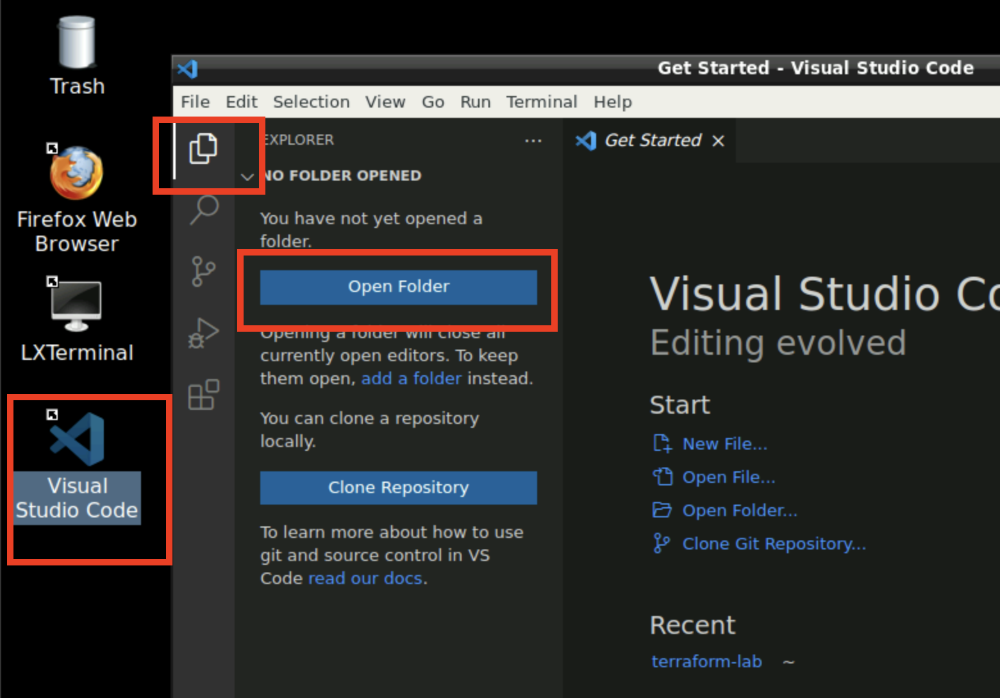
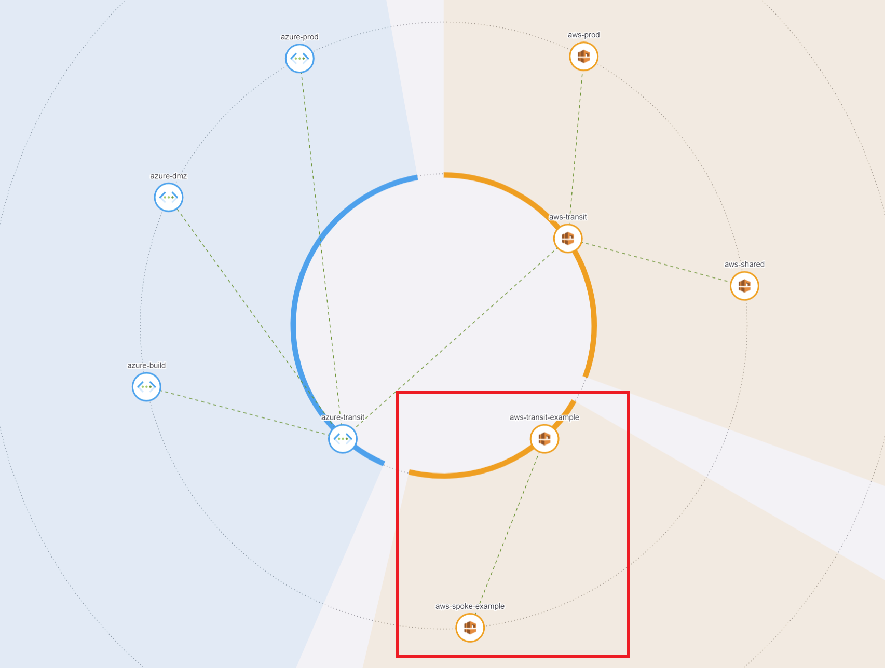
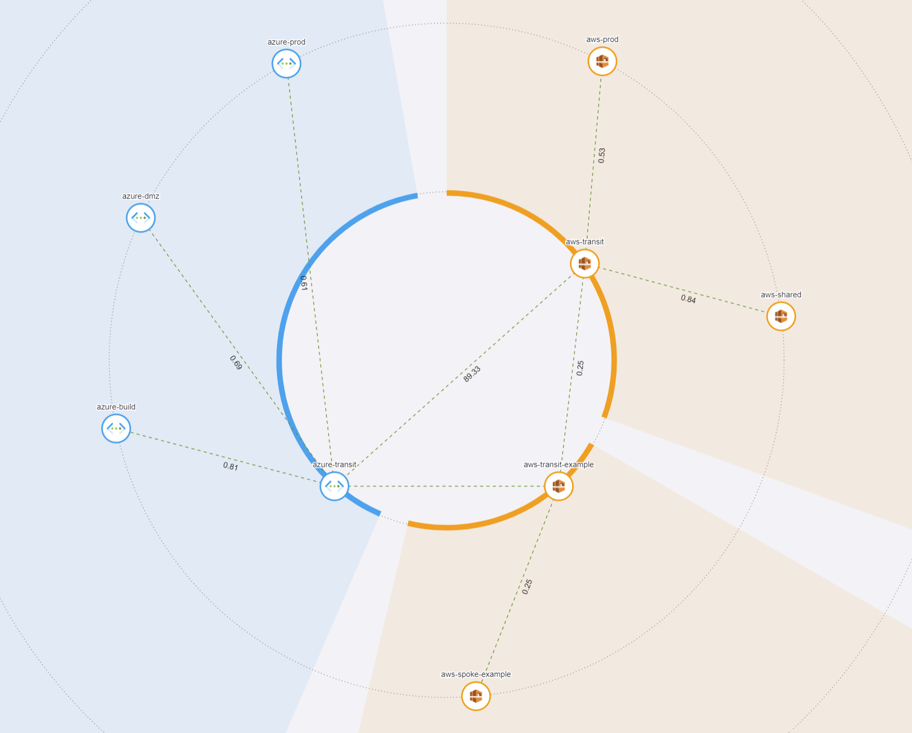

# Lab 5 - Infrastructure as Code (Bonus Lab)

## Lab 5.1 - Deploy Transit and Spoke

### Description

All the elements you have created through the UI, can also be created through the API or the official **Aviatrix Terraform provider**. You can find more information on these here:  
https://registry.terraform.io/providers/AviatrixSystems/aviatrix/latest/docs

### Validate

We have prepared some Terraform code for you, which you will explore and deploy.

* Open the Remote Access Server by navigating and logging in to `https://client.pod[#].aviatrixlab.com`
* Double-click on **RDP - Client**
* Open the **Visual Studio Code** located on the Desktop

  
_Fig. VS Studio_  

* Select the folder `terraform-lab` and click **Open**
  * _When prompted to trust the authors of the files in this folder, select Yes_
* Let’s explore the Terraform files in this directory:
  * Explore the file contents of **main.tf, variables.tf, providers.tf and vars.tfvars**

> What do you expect will be created when we run this Terraform code?

In this lab, we are using Terraform modules, provided by Aviatrix. These allow you to quickly build out your environment, based on larger building blocks, rather than individual resources. You can find more available modules here:  

https://registry.terraform.io/namespaces/terraform-aviatrix-modules  

Let's run this code.

* Open the **LXTerminal** App on the Desktop
* Move over to the directory where the Terraform files are located:

`cd terraform-lab`

* First thing we need to do is to initialize Terraform. This allows for the required providers and modules to be downloaded.  

`terraform init`

* Next we will execute a “plan”. This means that Terraform will compare the live environment with the desired state we declared in our Terraform files

`terraform plan`

* Investigate the proposed changes by Terraform. Now we will apply them to the live environment:

`terraform apply --auto-approve`

Once Terraform is finished, have a look at the newly created **terraform.tfstate** file. This contains information of all infrastructure created through Terraform. This is referred to as **“the state”**. Losing it can cause a lot of trouble, but that is for another (Terraform) lesson.

### Expected Results

By running the above commands, you should see how simple it can be to automate your infrastructure deployments using Terraform.  With a few lines of code and after a few minutes, you should see the new transit and spoke in CoPilot Topology.  

  
_Fig. Topology_  

## Lab 5.2 - Create Transit Peerings

### Description

In the previous exercise, we deployed a new Transit VPC, Aviatrix Transit Gateway, a Spoke VPC, and an Aviatrix Spoke Gateway.  This new deployment is more or less an island, but let's see how we can use Infrastructure as Code to build a full mesh of the Transits.

### Validate

* Using the same Visual Studio Code session, let's add some new code to the `main.tf` file
* We will be using the following module:  `https://registry.terraform.io/modules/terraform-aviatrix-modules/mc-transit-peering/aviatrix/latest`

```hcl
module "transit-peering" {
  source  = "terraform-aviatrix-modules/mc-transit-peering/aviatrix"
  version = "1.0.8"

  transit_gateways = [
    "aws-transit",
    "azure-transit",
    "aws-transit-example"
  ]

  #Lets make sure we don't mess with the transit peering that already exists.
  prune_list = [
    {"aws-transit" : "azure-transit"},
  ]
}
```

> Make sure that the Transit Gateway names match to your environment

* Save the file in Visual Studio Code
* Go back to the **LXTerminal** and run `terraform init` again to download the `mc-transit-peering` module
* Run the command `terraform plan` to assess the changes
* Run the command `terraform apply --auto-approve`

### Expected Results

After a few minutes, a full mesh between all Transit gateways should be created. You can go to CoPilot Topology and have a look at the full mesh Multicloud network that was created.

  
_Fig. Topology_  

## Lab 5 Summary

* You deployed an Aviatrix Transit and Spoke using Terraform
* You added the new Transit to the Global Multicloud Transit Network with a few lines of code
* Infrastructure as Code and Terraform are a perfect complement to the Aviatrix solution
* In minutes, you can create the network, security and connectivity needed
